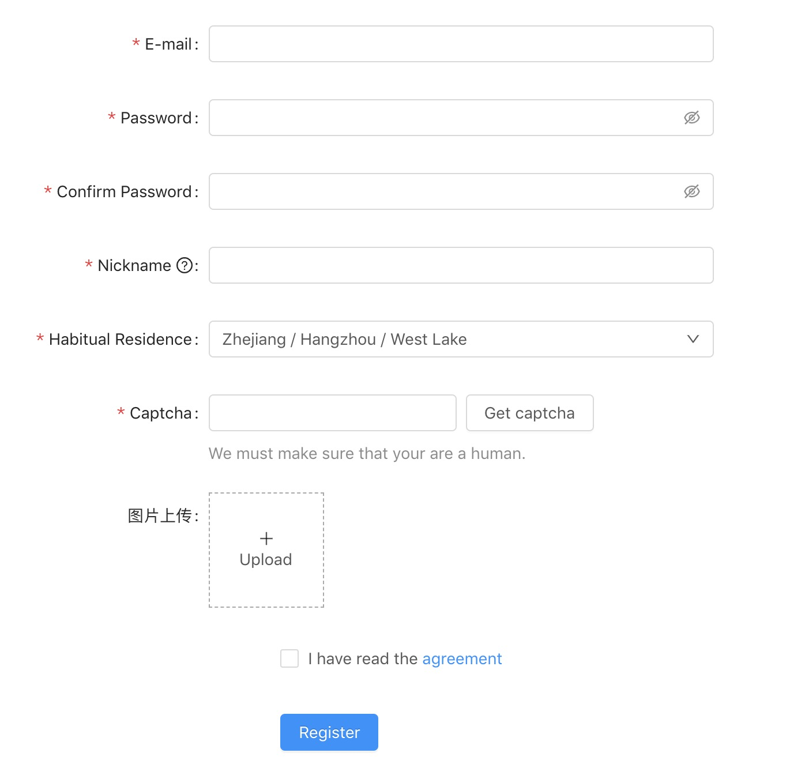

# react-antd-super-form

## Install

```bash
npm install --save react-antd-super-form
```

## Usage

```jsx
import React, { Component } from 'react';
import SuperForm, { Table, List, Form, Modal } from 'react-antd-super-form';

class Example extends Component {
  render () {
    return (
      <SuperForm
        // ...
        search={{}}
        table={{}}
      />
      <Form 
       // ...
       data={[]}
       data={(form)=>[]}
      />

    )
  }
}
```


### 封装原则
0. 0 样式
1. 尽量维持原 antd 组件属性命名,部分属性作变更(如, Button中type 因冲突变为 buttonType)
2. 增加其它 Form.Item 元素 相应属性配置
3. 优先级: visible > br >  group > render > type 
4. 事件注入,所有列表中的事件中新增加一个 form 参数, 如 onClick(e) => onClick(e, form) 完成对表单的控制
5. 通过设置 input hidden 隐藏域来新增属性
6. 通过属性中添加 ',' 英文逗号来屏蔽 此属性


### 基本结构
```jsx
<SuperForm
type="table|list" //default table
search={
  {
    layout: 'horizontal'|'vertical'|'inline'
    formLayout: {
      labelCol: { span: 2 },
      wrapperCol: { span: 14 },
    }
    data:[]
  }
}
table={
  {
    isInit: false,
    action: func,
    // params  // 在superform 中 params 自动绑定, 单独使用 table 组件, 可以手动传入 params form 参数
    // pagination // 分页配置
    // ...
  }
}
/>
```

### search 字段配置
```jsx
data = [
  {
    visible: true, // 默认 true,  组件是否渲染
    label: 'xxx', // FormItem label 标签, 非必填
    type: 'select', // ['br','span', 'group', 'button', 'input','inputnumber','select','radio','radiobutton','slider','textarea','checkbox','datepicker','rangepicker', 'monthpicker', 'timepicker', 'switch','upload','cascader','steps']

    unbind: false, // 非输入组件 建议必填, 
    key: 'xxx', // 输入组件必填, 非输入组件可不填, 建议必填: key 值中 如果包含有逗号则此参数在提交时会被过滤
    config: { // for 
      initialValue: 1
    },

    render: (form)=>{},
    renderFix: (item)=> item,

    style: {
      width: 100
    },
    placeholder: '请选择',
    // for select | radio | radiobutton | slider | checkbox
    options: [
      {label: '订单号', value: 1}
      {label: '手机号', value: 2}
    ]

  
    // For button
    text: '', // 按钮文案
    tp: 'primary',
    bindSearch: true|false, // 自动绑定搜索事件
    onClick(event, form),

    // for upload
    children:()=>{
      return <div>点我上传</div>
    }

    // for form item
    formItemLayout:{
      labelCol: { span: 2 },
      wrapperCol: { span: 14 },
    }
    // other
    ...
  },
]
```

### table 字段配置
```jsx
type="list|table"
columns={columns}
rowKey={"id"}
pagination={{

}}
isInit={true}
action={api.queryGoodsDetail}
params={() => {
  return {
    contentId: this.state.productId,
  }
}}


```


### 配置案例
```jsx
<SuperForm
  type="list|table"
  action={api.queryList}
  search={{
    layout: 'inline',
    data: [
      {
        label: '订单搜索',
        type: 'select',
        key: 'seartType',
        placeholder: '请选择',
        config: {
          initialValue: 1
        },
         options: [
                { label: '订单号', value: 1 },
                { label: '手机号', value: 2 },
                { label: '用户名', value: 3 },
              ],
        style: {
          width: 100
        }
      },
      {
        type: 'input',
        key: 'searKey',
        placeholder: '请输入',
        style: {
          width: 280
        }
      },
      {
        type: 'br'
      },
      {
        label: '测试多选',
        type: 'checkbox',
        key: 'f',
        options:[
          {label: 'A', value: 1},
          {label: 'B', value: 2},
          {label: 'C', value: 3},
        ],
        config: {
          initialValue: [1, 2]
        }
      },
      {
        type: 'br'
      },
      {
        label: '测试单选',
        type: 'radiobutton',
        key: '44',
        options: [
          {label: 'A', value: 1},
          {label: 'B', value: 2},
          {label: 'C', value: 3},
        ],
      },
      {
        type: 'br'
      },
      {
        label: '测试单选',
        type: 'radio',
        options: [
          {label: 'A', value: 1},
          {label: 'B', value: 2},
          {label: 'C', value: 3},
        ],
      },
      {
        type: 'br'
      },
      {
        label: '测试Slider',
        type: 'slider',
        marks: {
          0: 'A',
          20: 'B',
          40: 'C',
          60: 'D',
          80: 'E',
          100: 'F',
        },
        style: {
          width: 300
        },
        config: {
          initialValue: 40
        }
      },
      {
        type: 'br'
      },
      {
        label: '下单时间',
        type: 'rangepicker',
        key: 'time',
        placeholder: ['开始时间', '结束时间'],
        suffixIcon: <Icon type="clock-circle" />,
        showTime: true,
        style: {
          width: 400
        }
      },
      {
        type: 'button',
        key: 'test',
        size:"small",
        text: '今',
        onClick:(e, form) => {
            let date = new Date();
            form.setFieldsValue({
              time: [moment(`${date.getFullYear()}-${date.getMonth() + 1}-${date.getDate()}`, 'YYYY/MM/DD'), moment(date, 'YYYY/MM/DD')]
            })
          }
      },
      {
        key: 'test',
        unbind: true,
        render: (form) => {
          return (
            <Button
              size="small"
              onClick={() => {
                let date = new Date();
                let date2 = new Date();
                date.setTime(date.getTime() - 30 * 24 * 60 * 60 * 1000);
                form.setFieldsValue({
                  time: [moment(`${date.getFullYear()}-${date.getMonth() + 1}-${date.getDate()}`, 'YYYY/MM/DD'), moment(`${date2.getFullYear()}-${date2.getMonth() + 1}-${date2.getDate()}`, 'YYYY/MM/DD')]
                })
              }}
            >近30天</Button>
          )
        }
      },
      {
        type: 'br',
      },
      {
        label: '商品标题',
        type: 'input',
        key: 'productTitle',
        placeholder: '请输入',
        style: {
          width: 150
        }
      },
      {
        label: '订单类型',
        type: 'select',
        key: 'orderType',
        placeholder: '请选择',
        config: {
          initialValue: 1
        },
        options: {
          1: '订单号',
          2: '手机号',
          3: '用户名'
        },
        style: {
          width: 150
        }
      },
      {
        label: '订单来源',
        type: 'select',
        key: 'orderFrom',
        placeholder: '请选择',
        config: {
          initialValue: 1
        },
        options: {
          1: '订单号',
          2: '手机号',
          3: '用户名'
        },
        style: {
          width: 150
        }
      }, 
      {
        type: 'br'
      },
    ],
  }
  }
  table={{
    renderItem: (item, index) => this.renderItem(item, index, false)
  }}

></SearchList>
```

### Form


```jsx
import {Form} from './SuperForm';
// ...
<Form
  formLayout={{
    labelCol: {
      xs: { span: 24 },
      sm: { span: 8 },
    },
    wrapperCol: {
      xs: { span: 24 },
      sm: { span: 16 },
    },
  }}
  data={(form) => {
    const { getFieldDecorator } = form;
    return [
      {
        label: 'E-mail',
        type: 'input',
        key: 'email',
        config: {
          rules: [
            {
              type: 'email',
              message: 'The input is not valid E-mail!',
            },
            {
              required: true,
              message: 'Please input your E-mail!',
            },
          ],
        },
      },
      {
        label: 'Password',
        type: 'password',
        key: 'password',
        hasFeedback: true,
        config: (form) => {
          return {
            rules: [
              {
                required: true,
                message: '密码不能为空',
              }, {
                min: 4,
                message: '密码不能少于4个字符',
              }, {
                max: 6,
                message: '密码不能大于6个字符',
              },
              {
                validator: (rule, value, callback) => {
                  console.log(form)
                  if (value && this.state.confirmDirty) {
                    form.validateFields(['confirm'], { force: true });
                  }
                  callback();
                }
              },
            ],
          }

        },
      },
      {
        label: 'Confirm Password',
        type: 'password',
        key: 'confirm',
        hasFeedback: true,
        onBlur: (e) => {
          const { value } = e.target;
          this.setState({ confirmDirty: this.state.confirmDirty || !!value });
        },
        config: (form) => {
          return {
            rules: [
              {
                required: true,
                message: 'Please confirm your password!',
              },
              {
                validator: (rule, value, callback) => {
                  if (value && value !== form.getFieldValue('password')) {
                    callback('Two passwords that you enter is inconsistent!');
                  } else {
                    callback();
                  }
                },
              },
            ],
          }

        },
      },
      {
        label: <span>
          Nickname&nbsp;
    <Tooltip title="What do you want others to call you?">
            <Icon type="question-circle-o" />
          </Tooltip>
        </span>,
        type: 'input',
        key: 'nickname',
        config: {
          rules: [{
            required: true,
            message: 'Please input your nickname!',
            whitespace: true
          }],
        },
      },
      {
        label: 'Habitual Residence',
        key: 'residence',
        type: 'cascader',
        config: {
          initialValue: ['zhejiang', 'hangzhou', 'xihu'],
          rules: [
            { type: 'array', required: true, message: 'Please select your habitual residence!' },
          ],
        },
        options: [
          {
            value: 'zhejiang',
            label: 'Zhejiang',
            children: [
              {
                value: 'hangzhou',
                label: 'Hangzhou',
                children: [
                  {
                    value: 'xihu',
                    label: 'West Lake',
                  },
                ],
              },
            ],
          },
          {
            value: 'jiangsu',
            label: 'Jiangsu',
            children: [
              {
                value: 'nanjing',
                label: 'Nanjing',
                children: [
                  {
                    value: 'zhonghuamen',
                    label: 'Zhong Hua Men',
                  },
                ],
              },
            ],
          },
        ]
      },
      {
        label: 'Phone Number',
        type: 'input',
        key: 'phone',
        config: {
          rules: [{ required: true, message: 'Please input your phone number!' }],
        },
        addonBefore: getFieldDecorator('prefix', {
          initialValue: '86',
        })(
          <Select style={{ width: 70 }}>
            <Select.Option value="86">+86</Select.Option>
            <Select.Option value="87">+87</Select.Option>
          </Select>,
        )

      },
      {
        label: 'Captcha',
        key: 'captcha',
        type: 'input',
        config: {
          rules: [{
            required: true,
            message: 'Please input the captcha you got!'
          }],
        },
        extra: "We must make sure that your are a human.",
        renderFix: (item) => {
          return (<Row gutter={8}>
            <Col span={12}>
              {item}
            </Col>
            <Col span={12}>
              <Button>Get captcha</Button>
            </Col>
          </Row>)
        }
      },
      // {
      //   key: 'ke--',
      //   type: 'autocomplete',
      //   label: '自动完成',
      //   dataSource: [],
      //   style: { width: 200 },
      //   onSelect: () => { },
      //   onSearch: () => { },
      //   placeholder: "input here"
      // },
      {
        key: 'jj',
        type: 'rate',
        label: '评价',
        character: '好',
        allowHalf: true,
        config: {
          initialValue: 2.5
        }
      },
      {
        type: 'steps',
        label: '步骤',
        progressDot: true,
        current: 1,
        options: [
          {
            title: 'Finished',
            description: 'This is a description.'
          },
          {
            title: 'In Progress',
            description: 'This is a description.'
          },
          {
            title: 'Waiting',
            description: 'This is a description.'
          },
        ]
      },
      {
        type: 'radiobutton',
        label: '测试',
        key: 'aa',
        options: [
          {
            label: 'A',
            value: 1
          },
          {
            label: 'B',
            value: 2
          },
        ]
      },
      {
        label: '时间',
        type: 'group',
        unbind: true,
        formItemLayout: { style: { marginBottom: 0, width: 800 } },
        children: [
          {
            // label: 'Start',
            type: 'datepicker',
            key: 'startTime',
            validateStatus: "error",
            help: "Please select the correct date",
            formItemLayout: { style: { display: 'inline-block', width: 150 } },
          },
          {
            type: 'span',
            label: '至',
            style: {
              display: 'inline-block',
              width: 40,
              textAlign: 'center'
            }
          },
          {
            // label: 'End',
            type: 'datepicker',
            key: 'endTime',
            formItemLayout: { style: { display: 'inline-block', width: 150 } },
            onChange: () => {

            }
          },
        ]
      },
      {
        label: '图片上传',
        type: 'upload',
        key: 'searKey',
        listType: 'picture',
        config: {
          // initialValue: ['https://fanyi.bdstatic.com/static/translation/img/header/logo_40c4f13.svg'],
          initialValue: [
            {
              uid: '-1',
              name: 'xxx.png',
              status: 'done',
              url: 'https://zos.alipayobjects.com/rmsportal/jkjgkEfvpUPVyRjUImniVslZfWPnJuuZ.png',
              thumbUrl: 'https://zos.alipayobjects.com/rmsportal/jkjgkEfvpUPVyRjUImniVslZfWPnJuuZ.png',
            },
          ],
          valuePropName: "fileList",
          getValueFromEvent: e => {
            if (Array.isArray(e)) {
              return e;
            }
            return e && e.fileList;
          },
          rules: [{
            required: true,
            message: '请上传'
          }],
        },
        innerHTML: () => {
          return (<div style={{
            width: 100,
            height: 100,
            display: 'flex',
            flexDirection: 'column',
            justifyContent: 'center',
            alignItems: 'center',
            border: '1px dashed darkgray'
          }}>
            <Icon type={this.state.loading ? 'loading' : 'plus'} />
            <div className="ant-upload-text">Upload</div>
          </div>)
        }
      },
      {
        formItemLayout: {
          wrapperCol: {
            xs: {
              span: 24,
              offset: 0,
            },
            sm: {
              span: 16,
              offset: 8,
            },
          },
        },
        key: 'agreement',
        config: {
          valuePropName: 'checked',
        },
        type: 'checkbox',
        innerHTML: () => {
          return <span>I have read the <a href="">agreement</a></span>
        }
        // render: (form) => {
        //   return <Checkbox></Checkbox>
        // }
      },
      {
        formItemLayout: {
          wrapperCol: {
            xs: {
              span: 24,
              offset: 0,
            },
            sm: {
              span: 16,
              offset: 8,
            },
          },
        },
        // key: 'agreement',
        type: 'button',
        buttonType: 'primary',
        text: 'Register',
        onClick: () => {
          form.validateFields((errors, values) => {
            // ...
          });
          console.log(form.getFieldsValue())
        }
      },
    ]
  }
  }
/>
```

### Modal
```jsx
import {Modal} from './SuperForm';
// ...
<Modal
  ref="testDialog"
  onCancel={() => console.log('...')}
  afterClose={() => console.log('after...')}
  width={800}
  onOk={(e, form, show) => {
    console.log(e, form.getFieldsValue());
    show(false)
  }}
  footer={[
    <Button key='A' onClick={() => {
      console.log('A', this.refs.testDialog.getFieldsValue())
    }}>A</Button>,
    <Button key='B' onClick={() => {
      console.log('B')
    }}>B</Button>,
  ]}
  form={{
    // layout: 'inline',
    formLayout: {
      labelCol: {
        xs: { span: 24 },
        sm: { span: 8 },
      },
      wrapperCol: {
        xs: { span: 24 },
        sm: { span: 16 },
      },
    },
    data: [
      {
        label: 'E-mail',
        type: 'input',
        key: 'email',
        config: {
          rules: [
            {
              type: 'email',
              message: 'The input is not valid E-mail!',
            },
            {
              required: true,
              message: 'Please input your E-mail!',
            },
          ],
        },
      },
      
    ]
  }}
>
</Modal>
```

## License

MIT © [bitores](https://github.com/bitores)
