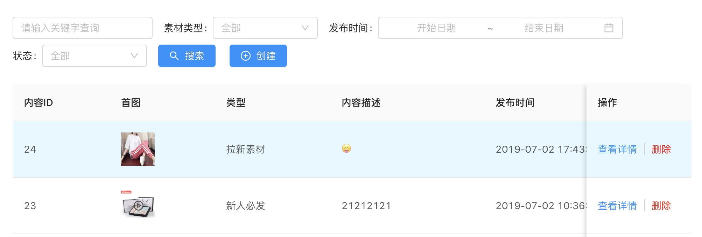
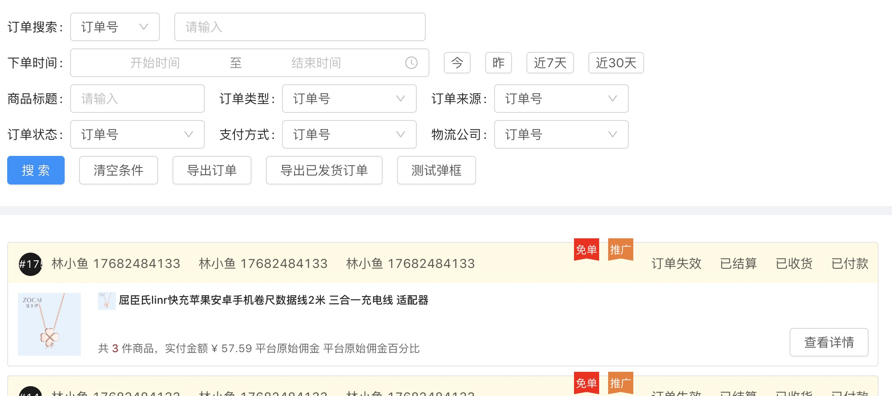

# Table & List

Table & List 组件对常见的数据请求分页处理逻辑进行了封装, 提高后台开发效率


### 使用
```jsx
import {Table, List} from 'react-antd-super-form';
```
### 字段配置
```jsx
<Table
  // 扩展属性
  // 是否开始时进行 action 进行调用
  isInit={true|false},
  // 数据请求的处理函数
  action={func},
  // 接口数据 返回值 res 与 组件内字段完成 映射, list 为数据数组, total 为 数据量, status 为接口是否正常
  valueMap = {(res) => {
    return {
      status: true,
      list: res.entry,
      total: res.totalRecordSize
    }
  }},
  pageName = {},
  pageSizeName = {},
  // 附加参数
  extraParams = {()=>{}},
  // antd Table 固有属性
  {...prop}
/>
```
